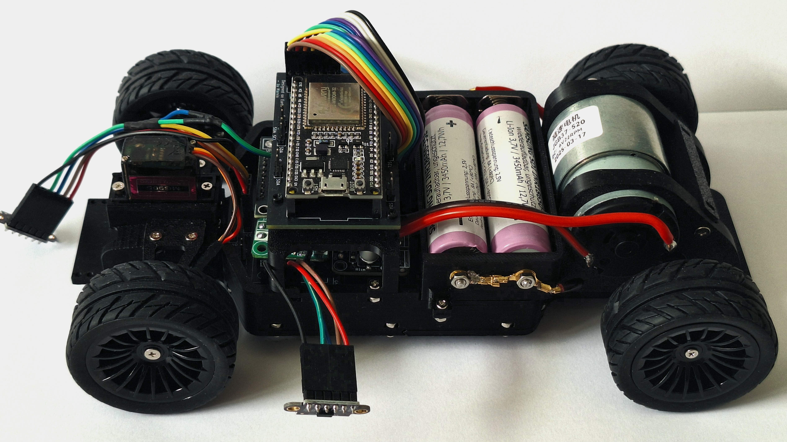
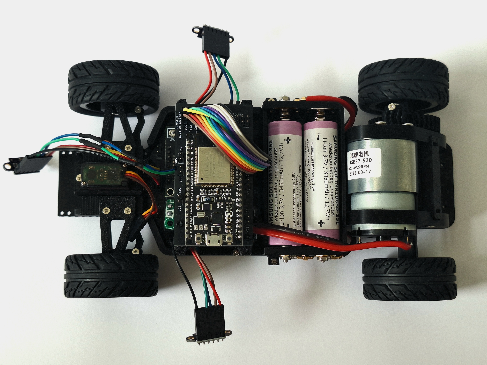
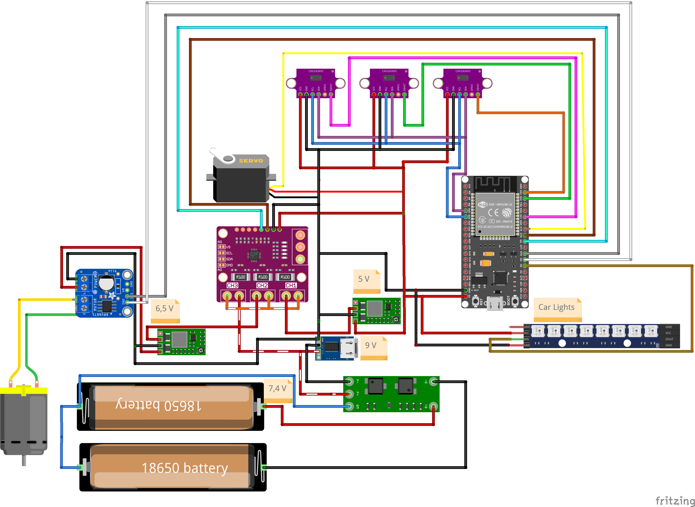

# 3D-Printed ESP32 RC Car – Complete Project Documentation




## Project Overview
This project consists of a fully 3D-printed RC car based on an ESP32 controller, designed for remote control via a custom-built app.  
All mechanical parts, electronics (PCBs), and software components are fully self-developed or heavily customized.

The vehicle body is based on a DeLorean model (Back to the Future), which has been modified for integration of custom hardware components and a clear interior view.

---

## Features
- **Drive System**:
    - JGB37-520 Motor connected via an axle with ball bearings
    - Front axle controlled by MG90S servo
- **Distance Sensors**:
    - 3x VL53L0X laser distance sensors connected via I2C bus
- **Camera**:
    - ESP32-CAM module for live video streaming over WiFi
- **Lighting**:
    - WS2812C individually addressable LEDs for headlights, taillights, indicators, brake lights, and reverse lights
- **Battery**:
    - 2x Samsung SDI INR18650-35E 3.7V cells (combined to 7.2V system)
- **Charging**:
    - USB-C PD (Power Delivery) charging at 9V/3A via custom charging module
- **Battery Management System (BMS)**:
    - HX-2S-D20 unit for safe charging/discharging

---


## Mechanical Design
- **Chassis**: Modified base from DKS Basics, adjusted for optimized motor mounts, axle supports, battery placement, ESP32 mounting, and PCB integration.
- **Body**: DeLorean STL, modified for wheel clearance, USB-C charging access, and removal of windows for better visibility of internal components.
- **3D Printed Parts**:
    - Chassis components
    - Gear holders and servo brackets
    - Motor mounts
    - Sensor mounts
    - Battery compartments
    - LED lighting holders

---


## Bill of Materials (BOM)

| Component                   | Description                                           |
|------------------------------|-------------------------------------------------------|
| ESP32                        | Main microcontroller                                 |
| JGB37-520 Motor              | Drive motor                                           |
| MG90S Servo                  | Steering servo                                        |
| 3x VL53L0X                   | Distance sensors (I2C bus)                           |
| 2x Samsung INR18650-35E      | Battery cells                                         |
| INA3221                      | Triple current monitor                               |
| HX-2S-D20                    | 2S BMS for battery management                        |
| ESP32-CAM                    | Camera module                                         |
| WS2812C LED Strip            | Addressable LEDs for lighting                        |
| Custom Power PCB             | Power regulation and distribution board             |
| Custom ESP32 PCB             | ESP32 interface board                               |
| Front LED PCBs (x2 variants) | Strip & individual LED board for front lighting      |
| Rear LED PCBs (x2 variants)  | Strip & individual LED board for rear lighting       |
| 3D Printed Parts             | Chassis, body, mounting structures                   |
| USB-C Charging Module        | USB-PD fast charging support                         |
| Bearings, Gears, Shafts      | Mechanical components                               |

---


## Repository Structure

```bash
/3d-printed-esp32-rc-car
│
├── 3d_printed_parts/             # STL files for chassis and case
│
├── pcbs/
│   ├── power_pcb/                # KiCad files and Gerbers for power management board
│   ├── esp32_pcb/                # KiCad files and Gerbers for ESP32 connection board
│   ├── lighting_pcbs/
│   │   ├── front_strip_version/  # PCB for front LED strip mounting
│   │   ├── front_single_led/     # PCB for front individual LEDs
│   │   ├── rear_strip_version/   # PCB for rear LED strip mounting
│   │   └── rear_single_led/      # PCB for rear individual LEDs
│
├── firmware/                     # (External Link: [ESP32 Firmware Repo](https://github.com/Marvin-VW/bluetooth_car_cpp))
│
├── app/                          # (External Link: [Mobile App Repo](https://github.com/Marvin-VW/spring_rest_todo_app))
│
├── images/                       # Photos, renderings, diagrams
│
└── README.md                     # This file
```

---


## Electronic Architecture

### Main Boards:
- **Power PCB**:
    - Battery management (charging/discharging)
    - 5V and 6.6V regulated outputs
    - INA3221 triple current sensor
    - Connectors for servo, distance sensors, motor
- **ESP32 PCB**:
    - Dedicated ESP32 interface
    - Connection to power PCB via a 2x7 (14-pin) connector

### Lighting Boards:
- **Front LED Boards**:
    - *LED Strip Version*: For easier integration of flexible LED strips (WS2812C-compatible)
    - *Individual LED Version*: For precise placement of discrete WS2812C LEDs
- **Rear LED Boards**:
    - *LED Strip Version*
    - *Individual LED Version*

Each lighting board is tailored to fit into designated 3D printed holders.

---



Note: Pins not accurate.

---

## Build and Assembly

1. **3D Print Parts**  
   Print all required STL files using PLA or PETG for maximum durability.

2. **Assemble Electronics**
    - Solder PCBs based on provided KiCad projects.
    - Install the Power PCB, ESP32 PCB, distance sensors, and LEDs.

3. **Mechanical Assembly**
    - Mount motor, servo, and axles with ball bearings.
    - Install batteries, boards, and secure the chassis components.

4. **Install Firmware**
    - Flash the ESP32 using the firmware available in the firmware repository.

5. **App Setup**
    - Install the mobile app to control the car via WiFi.

6. **Testing and Calibration**
    - Test motor, servo, sensors, and LEDs individually before full operation.

---

## License
MIT License

---

## Contributions
Contributions, issues, and feature requests are welcome! Feel free to check the [issues page](#).